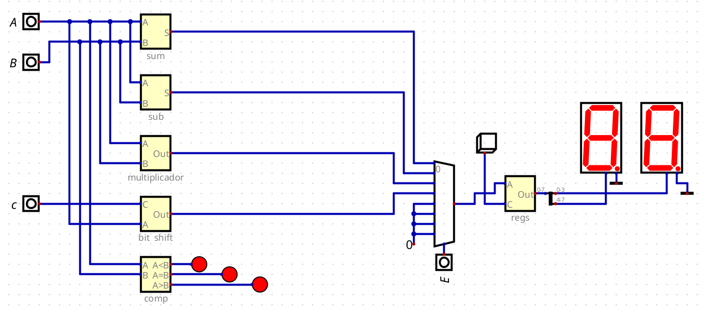

# Processador-8bits-ALU
ALU e sistema de escolha de operação

# Documentação das Unidades Lógicas e Aritméticas (ALU) de um Processador

Este documento mostra o funcionamento e a implementação das Unidades Lógicas e Aritméticas (ALU) de um processador, desenvolvidas utilizando o simulador de circuitos [Digital](https://github.com/hneemann/Digital).

## Introdução

As Unidades Lógicas e Aritméticas (ALU) são componentes essenciais de qualquer processador. Elas são responsáveis por realizar as operações matemáticas e lógicas básicas, como soma, subtração, e operações bit a bit. Neste projeto, as ALUs foram modeladas e simuladas utilizando o software Digital, um simulador de circuitos lógicos que permite a criação de projetos de hardware digitais e sua simulação.

## Instalação do Simulador Digital

Para simular e testar o funcionamento do processador, é necessário utilizar o programa [Digital](https://github.com/hneemann/Digital) ou similares, um simulador de circuitos lógicos open-source.

### Passos para Instalação

1. Siga as Instruções do Respositório no site da [Digital](https://github.com/hneemann/Digital) 

2. Clone o repositório oficial do Digital:
   ```bash
   git clone https://github.com/hneemann/Digital.git
    ```

# Documentação dos Circuitos de 8 Bits

Este documento descreve a implementação dos circuitos de 8 bits para operações aritméticas e lógicas, incluindo Somador, Subtrator, Multiplicador (4 bits), Shift de Bits e Comparador. As imagens dos circuitos estão armazenadas no diretório `img` e são referenciadas ao longo deste documento.

## Sumário

- [Somador de 8 Bits](#somador-de-8-bits)
- [Subtrator de 8 Bits](#subtrator-de-8-bits)
- [Multiplicador de 4 Bits](#multiplicador-de-4-bits)
- [Bit Shift](#bit-shift)
- [Comparador de 8 Bits](#comparador-de-8-bits)

## Somador de 8 Bits

O **Somador de 8 Bits** realiza a soma de dois números de 8 bits, utilizando portas lógicas para combinar os bits correspondentes e calcular o carry.


Circuito Complementar


### Funcionamento

Cada bit é somado individualmente com seu correspondente, e o carry é propagado para os bits seguintes. Este circuito é a base para várias operações aritméticas mais complexas.

## Subtrator de 8 Bits

O **Subtrator de 8 Bits** realiza a subtração entre dois números binários de 8 bits, utilizando o complemento de dois para fazer a operação.


Circuito Complementar


### Funcionamento

O circuito do subtrator utiliza o complemento de dois para realizar subtrações de maneira semelhante à soma, porém com a manipulação do bit de sinal.

## Multiplicador de 4 Bits

O **Multiplicador de 4 Bits** multiplica dois números de 4 bits e retorna um produto de até 8 bits. Este circuito pode ser expandido para realizar operações de multiplicação de 8 bits com pequenos ajustes.


Circuito Complementar - Utiliza o circuito do Somador SA

### Funcionamento

O circuito utiliza somas parciais e deslocamento de bits para calcular o produto final. Multiplicadores menores, como este de 4 bits, são frequentemente combinados para operações com números maiores.

## Bit Shift

O **Circuito de Bit Shift** realiza operações de deslocamento de bits, tanto à esquerda quanto à direita, em um número de 8 bits. O deslocamento pode ser usado em várias operações aritméticas e lógicas.


### Funcionamento

O circuito utiliza multiplexadores para controlar o número de posições que os bits devem ser deslocados, facilitando a operação de shifts dinâmicos.

## Comparador de 8 Bits

O **Comparador de 8 Bits** compara dois números binários de 8 bits e retorna três sinais: `igual`, `maior que` e `menor que`.


Circuito Complementar - Meio Comparador


Circuito Complementar - Comparador de 1 Bit


### Funcionamento

O comparador compara cada bit individualmente, começando pelos bits mais significativos, até determinar se o primeiro número é maior, menor ou igual ao segundo.

## Seletor de Circuito

O **Seletor de Circuito** é responsável por escolher entre diferentes operações, como soma, subtração, multiplicação e outras operações lógicas. Ele utiliza sinais de controle para selecionar a operação desejada.



### Funcionamento

O seletor utiliza multiplexadores para encaminhar os dados corretos para o circuito correspondente com base nos sinais de controle. Isso permite a implementação de múltiplas operações em um único circuito lógico.


## Referências de Estudos

Somador - Aula do Nicola e https://www.youtube.com/watch?v=wmOh9Gsnlss

Subtrador - https://www.youtube.com/watch?v=EOpa2XrnO-A

Bit Shift - https://www.youtube.com/watch?v=wNx_H4PCuow

Comparador - https://circuitverse.org/users/188319/projects/comparador-de-8-bits-9e3d5568-807e-441a-b5a9-2bdbf6e52412

Multiplicador - https://www.youtube.com/watch?v=vh1x1389se8
